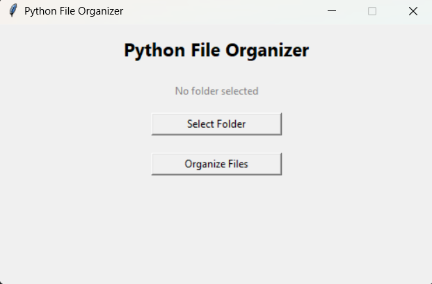

# 📁 Python File Organizer

A practical Python utility that automatically organizes files in a folder into
categories such as Images, Documents, Videos, Audio, Archives, and Others.

This project was built as a quick, one-day Python automation project to practice
real-world file handling using modern Python tools.

---

## 🚀 Features

- Organizes files by extension
- Creates category folders automatically
- Handles duplicate filenames safely
- Safe to run multiple times
- Works on Windows, macOS, and Linux
- Includes both CLI and GUI versions
- Simple Tkinter-based desktop interface


---

## 🛠️ Technologies Used

- Python 3
- pathlib
- shutil
- Tkinter

---

## 📂 File Categories

| Category   | Extensions |
|-----------|------------|
| Images    | `.jpg`, `.jpeg`, `.png`, `.gif`, `.webp` |
| Documents | `.pdf`, `.docx`, `.doc`, `.txt`, `.pptx`, `.xlsx` |
| Videos    | `.mp4`, `.mkv`, `.avi` |
| Audio     | `.mp3`, `.wav` |
| Archives  | `.zip`, `.rar`, `.7z` |
| Others    | Files that do not match any category |

---

## ▶️ How to Run the Project

### 1️⃣ Clone the repository
```bash
git clone https://github.com/YOUR_USERNAME/python-file-organizer.git

### 2️⃣ Open the project folder
cd python-file-organizer

### 3️⃣ Update the folder path
Open file_organizer.py and update this line:
TARGET_FOLDER = Path(r"C:\Path\To\Your\Folder")

### 4️⃣ Run the script
python file_organizer.py

### GUI Version
```bash
python file_organizer_gui.py


📌 Example Use Case
Use this script to clean up a messy Downloads or Test folder with a single command.

🔮 Possible Improvements
- Accept folder path via user input
- Organize files by date
- Convert to an executable
- Add logging

## 📸 Screenshot


👤 Author
Sairam V
